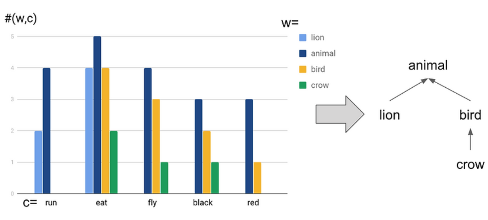
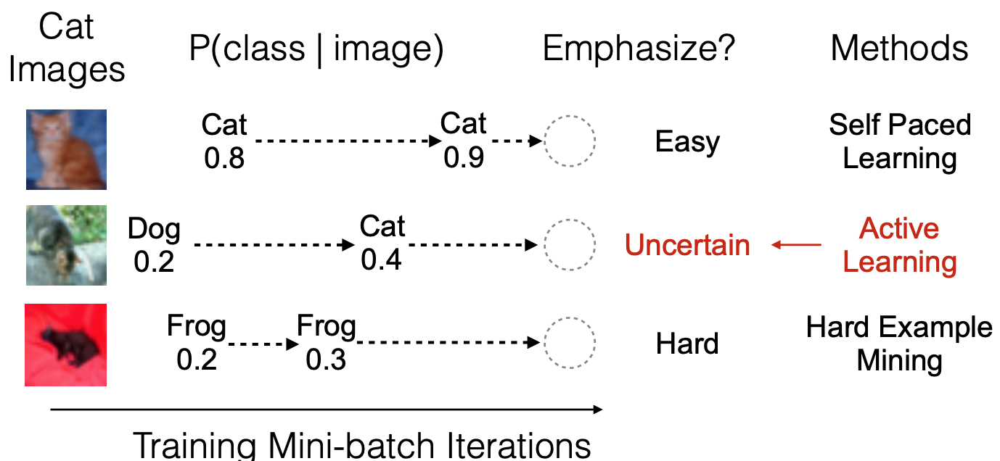

<!--

  

    
  

  

    <h4></h4>
    

    

  

-->

<!-- 02.22[CY] -->
<h2 calss="cat-header">Natural Language Processing</h2>

  

    
  

  

    <h4>Multi-facet Embeddings for Controlling the Topics of Language Generation</h4>
    

      We design a framework that displays multiple candidate upcoming topics, of which a user can select a subset to guide the generation. Our framework consists of two components: (1) a method that produces a set of candidate topics by predicting the centers of word clusters in the possible continuations, and (2) a text generation model whose output adheres to the chosen topics. The training of both components is self-supervised, using only unlabeled text. Our experiments demonstrate that our topic options are better than those of standard clustering approaches, and our framework often generates fluent sentences related to the chosen topics, as judged by automated metrics and crowdsourced workers.
      (<a href="http://arxiv.org/abs/2103.15335">Paper</a>, <a href="https://github.com/iesl/interactive_LM">Code</a>, <a href="https://slideslive.com/38954487/changing-the-mind-of-transformers-for-topicallycontrollable-language-generation">Talk</a>, <a href="https://f6d60bef-de96-4b94-b613-4913f88f2f0f.filesusr.com/ugd/e150d8_8212c213a26a4c36acc69989aec2399c.key?dn=EACL_interactive_LM.key">Slides</a>, <a href="https://f6d60bef-de96-4b94-b613-4913f88f2f0f.filesusr.com/ugd/e150d8_87e429adfcb9478e86a55033df144458.pdf">Poster</a>)
    

  

  

    
  

  

    <h4>Multi-facet Embeddings for Relation Extraction</h4>
    

      We propose multi-facet universal schema that uses a neural model to represent each sentence pattern as multiple facet embeddings and encourage one of these facet embeddings to be close to that of another sentence pattern if they cooccur with the same entity pair. In our experiments, we demonstrate that multi-facet embeddings significantly outperform their single facet embedding counterpart, compositional universal schema (Verga et al., 2016), in distantly supervised relation extraction tasks. Moreover, we can also use multiple embeddings to detect the entailment relation between two sentence patterns when no manual label is available.
      (<a href="http://arxiv.org/abs/2103.15335">Paper</a>, <a href="https://github.com/iesl/interactive_LM">Code</a>, <a href="https://slideslive.com/38954487/changing-the-mind-of-transformers-for-topicallycontrollable-language-generation">Talk</a>, <a href="https://f6d60bef-de96-4b94-b613-4913f88f2f0f.filesusr.com/ugd/e150d8_8212c213a26a4c36acc69989aec2399c.key?dn=EACL_interactive_LM.key">Slides</a>, <a href="https://f6d60bef-de96-4b94-b613-4913f88f2f0f.filesusr.com/ugd/e150d8_97d81dbfca604d07b825f2214805166a.pdf">Poster</a>)
    

  

  

    
  

  

    <h4>Multi-facet Embeddings for Sentence Representation</h4>
    

      We propose a novel embedding method for a text sequence (e.g., a sentence) where each sequence is represented by a distinct set of multi-mode codebook embeddings to capture different semantic facets of its meaning. The codebook embeddings can be viewed as the cluster centers which summarize the distribution of possibly co-occurring words in a pre-trained word embedding space. Our experiments show that the per-sentence codebook embeddings significantly improve the performances in unsupervised sentence similarity and extractive summarization benchmarks. (<a href="http://arxiv.org/abs/2103.15330">Paper</a>, <a href="https://docs.google.com/presentation/d/1k-OBWdBYsGmXUuvNc1_J_JrEppB_Aqh82bJPCgjFL-s/edit?usp=sharing">Slides</a>, <a href="https://f6d60bef-de96-4b94-b613-4913f88f2f0f.filesusr.com/ugd/e150d8_3d91e4f3cd6746aeaf24407fc0b674d1.pdf">Poster</a>). 
    

  

  

    
  

  

    <h4>Overcoming Practical Issues of Deep Active Learning</h4>
    

      Existing deep active learning algorithms achieve impressive sampling efficiency on natural language processing tasks. However, they exhibit several weaknesses in practice, including (a) inability to use uncertainty sampling with black-box models, (b) lack of robustness to noise in labeling, (c) lack of transparency. In response, we propose a transparent batch active sampling framework by estimating the error decay curves of multiple feature-defined subsets of the data.We perform extensive experiments on four named entity recognition (NER) tasks and results show that our methods greatly alleviate these limitations without sacrificing too much sampling efficiency. 
      (<a href="https://arxiv.org/abs/1911.07335">Paper</a>, <a href="https://slideslive.com/38933012/using-error-decay-prediction-to-overcome-practical-issues-of-deep-active-learning-for-named-entity-recognition">Slides</a>, <a href="https://slideslive.com/38933012/using-error-decay-prediction-to-overcome-practical-issues-of-deep-active-learning-for-named-entity-recognition">Talk</a>).
    

  

  

    
  

  

    <h4>Distributional Inclusion Vector Embedding</h4>
    

      We propose a novel word embedding method which preserves the distributional inclusion property in the sparse-bag-of-word (SBOW) feature. The embedding can be used to predict generality of words, detect the hypernym relation, and discover the topics from the raw text simultaneously. The extensive experiments show that the embedding effectively compresses the SBOW, and achieves new state-of-the-art performances on the unsupervised hypernym detection tasks (<a href="https://arxiv.org/abs/1710.00880">Paper</a>, <a href="https://github.com/iesl/Distributional-Inclusion-Vector-Embedding">Code</a>, <a href="https://bl.ocks.org/chsu5358/raw/f08d4755b0f04e113c139a72a977df5c/">Demo</a>, <a href="https://f6d60bef-de96-4b94-b613-4913f88f2f0f.filesusr.com/ugd/e150d8_925731e34b974de881cbe54f66807d36.pdf">Poster</a>). We also show that DIVE could help us to do word sense induction more efficiently (<a href="https://arxiv.org/abs/1804.03257">Paper</a>, <a href="https://f6d60bef-de96-4b94-b613-4913f88f2f0f.filesusr.com/ugd/e150d8_ae5222766cda446985cce83c1c72bae3.pdf">Slides</a>).
    

  

  

    
  

  

    <h4>UMASS TAC 2016 system for relation extraction</h4>
    

      TAC-KBP is one of the most challenging text-based information retrieval tasks. We integrate research which is done in UMASS IESL in the past year, including embedding linker, multilingual Universal Schema, and LSTM sentence embedding. We perform extensive error analysis and develop some novel techniques (such as using a search engine to reduce noise in training data) to tackle the problems (<a href="https://f6d60bef-de96-4b94-b613-4913f88f2f0f.filesusr.com/ugd/e150d8_3b991c00b5e748b6b41c1c19bf2668e0.pdf">Paper</a>).
    

  

<!-- Neural Network -->
<h2 style="color: #00369f">Neural Network</h2>

  

    
  

  

    <h4>Use Active Learning to Improve SGD [Better title?]</h4>
    

    Inspired by active learning, we propose two alternatives to re-weight training samples based on lightweight estimates of sample uncertainty in stochastic gradient descent (SGD). Extensive experimental results on six datasets show that our methods reliably improve accuracy in various network architectures, including additional gains on top of other popular training techniques (<a href="https://arxiv.org/abs/1704.07433">Paper</a>, <a href="https://arxiv.org/abs/1704.07433">Poster</a>).
    

  

<!-- Education -->
<h2 style="color: #00369f">Education</h2>

  

    
  

  

    <h4>Student Modeling and Prerequisite Verification in Knowledge Tree</h4>
    

    We extract answering logs of the exercises from <a href="https://www.junyiacademy.org/">Junyi Academy</a>, an E-learning website similar to Khan Academy.
    

    

    We use crowdsourcing and machine learning to discover relationships between exercises. Based on that, we will design a mechanism of adaptive test to improve learning experiences of Junyi academy (<a href="https://f6d60bef-de96-4b94-b613-4913f88f2f0f.filesusr.com/ugd/e150d8_059b30bf7b2444e7a8e0814baf9e1fd7.pdf">Paper</a>, <a href="https://f6d60bef-de96-4b94-b613-4913f88f2f0f.filesusr.com/ugd/e150d8_d281f5be254b434eb095cfc9d84cf75d.pptx?dn=Modeling%20Exercise%20Relationships%20in%20E-Learning_release.pptx">Presentation</a>, <a href="http://people.umass.edu/hawshiuancha/junyi_dependency_prediction.zip">Demo</a>, <a href="https://pslcdatashop.web.cmu.edu/DatasetInfo?datasetId=1198">Dataset</a>).
    

  

<!-- Computer Vision & Multimedia-->
<h2 style="color: #00369f">Computer Vision and Multimedia</h2>

  

    
  

  

    <h4>Active Sampling for estimating QoE model</h4>
    

    We use Bayesian learning to model the non-linear relationships between quality of experience (QoE) and multiple factors.
    

    

    Our experiment shows that active sampling can be used to reduce the number of samples collected from crowdsourcing for building such model (<a href="https://f6d60bef-de96-4b94-b613-4913f88f2f0f.filesusr.com/ugd/e150d8_50ae23ac1a7f4a46a4b3065b26f0c84a.pdf">Paper</a>).
    

  

  

    
  

  

    <h4>Hierarchical Image Segmentation without Training</h4>
    

    We proposed a general framework which applies classifiers with different complexity to discriminate segments in an image.
    

    

    Our unsupervisedhierarchical segmentation results achieve similar or better performance in several standard benchmarks compared with the current state-of-the-art methods based on learning, and has been accepted to ACCV 2014 (<a href="https://f6d60bef-de96-4b94-b613-4913f88f2f0f.filesusr.com/ugd/e150d8_242e704833024ea4a6723dfd884e85ff.pdf">Paper</a>, <a href="https://f6d60bef-de96-4b94-b613-4913f88f2f0f.filesusr.com/ugd/e150d8_f6c41538d19a4788a7efd64ffcfd01be.pdf">Poster</a>).
  

  

  

    
  

  

    <h4>Decomposi-tion of Multiple Foreground Co-segmentation</h4>
    

    We proposed an efficient algorithm which decomposes the unsupervised Multiple Foreground Co-segmentation problem into three sub-problems: segmentation, matching and figure-ground classification.
    

    

    Our method improves the accuracy of the state-of-the-art method by 13% in a standard benchmark, and has been accepted by CVIU (<a href="https://f6d60bef-de96-4b94-b613-4913f88f2f0f.filesusr.com/ugd/e150d8_6e352dd41985407bb5db08b256f1d333.pdf">Paper</a>)
    

  

  

    
  

  

    <h4>Superpixel-Based Large Displacement Optical Flow</h4>
    

    We formulated our objective function at the superpixel level rather than the pixel level as the traditional optical flow method did.

    

    Our method achieves better large displacement matching capability than LDOF in videos with lower quality , and has been accepted to ICIP 2013 (<a href="https://f6d60bef-de96-4b94-b613-4913f88f2f0f.filesusr.com/ugd/e150d8_71ff29f7b6fc4c45822bb2e097dd0b45.pdf">Paper</a>, <a href="https://f6d60bef-de96-4b94-b613-4913f88f2f0f.filesusr.com/ugd/e150d8_4e98e9d181694a5f9724a6698a1dac98.pdf">Poster</a>).
    

  

<!-- [Grids] pages/projects.md -->

  
  
    <!-- Display categorized projects -->
    
    <h2 class="category">{{ category }}</h2>
    
    
    <!-- Generate cards for each project -->
    
    

      

      
        
      
      

    

    
    

      
        
      
    

    
    

  
  <!-- Display projects without categories -->
    
    <!-- Generate cards for each project -->
    
    

      

      
        
      
      

    

    
    

      
        
      
    

    
  


